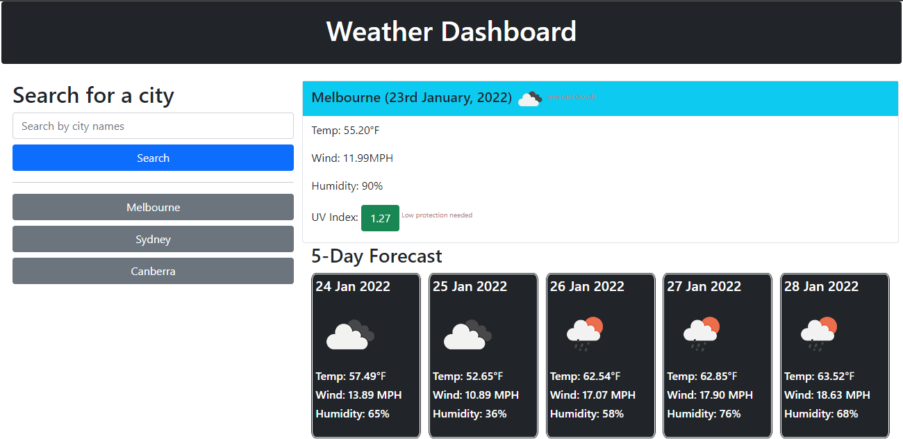

# <Weather Dashboard>

## User Story

```
AS A traveler
I WANT to see the weather outlook for multiple cities
SO THAT I can plan a trip accordingly
```

## Acceptance Criteria

```
GIVEN a weather dashboard with form inputs
WHEN I search for a city
THEN I am presented with current and future conditions for that city and that city is added to the search history
WHEN I view current weather conditions for that city
THEN I am presented with the city name, the date, an icon representation of weather conditions, the temperature, the humidity, the wind speed, and the UV index
WHEN I view the UV index
THEN I am presented with a color that indicates whether the conditions are favorable, moderate, or severe
WHEN I view future weather conditions for that city
THEN I am presented with a 5-day forecast that displays the date, an icon representation of weather conditions, the temperature, the wind speed, and the humidity
WHEN I click on a city in the search history
THEN I am again presented with current and future conditions for that city
```

## Description
The Weather-Dashboard is built to view current and foreacast weather for the next five days. The design of the website is built using bootstrap. When a user enters a city name the website fetches data from open weather API and the elements are dynamically presented. Major learnings were deeper understanding of API calls, asynchronous aspects of a promise with DOM manipulation.

## Application
The application can be accessed with this link:
[Weather Dashboard](https://razor-ray.github.io/Weather-Dashboard/)

## Screenshot
Below is a screenshot of the application



## Installation
Google Chrome or any other equivalent is required to run this project.
Google chrome can be downloaded from [Google](https://www.google.com.au/chrome/?brand=YTUH&gclid=Cj0KCQiA2sqOBhCGARIsAPuPK0j6dMkIFsf2OpJKfpZegbBj_cN3xsyBrr3XNPesFf1JWMF_9SC3x_4aAv2mEALw_wcB&gclsrc=aw.ds)

## Usage
After installaion of google chrome, this application can be run in the browser directly.
